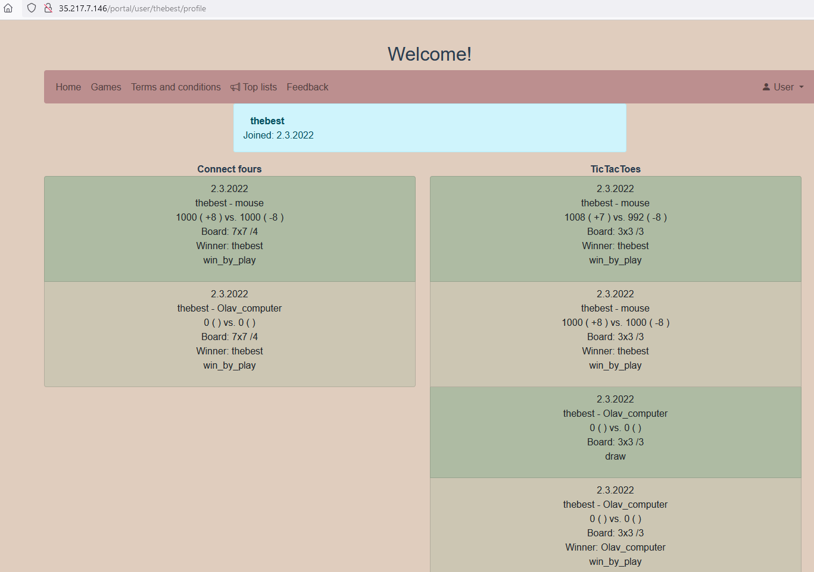

The site with two games, tic-tac-toe and connect four, is currently running @ http://35.217.7.146/portal/index.html 
 
### 02.03.2022
New deployment: with read player profile page containing game history. Tag "prod-rel-1.0.2" .
 
### 19.2.2022
New deployment with player top-lists. Package "prod-rel-1.0.1" .

### 14.2.2022
Initial release
 

 

## Further development ideas

UI:
* Add sorting for tables and users, own tab per game for example.
* Make optional notification sound when user enters/creates new table.

Backend:
* New Game?

General:
* Site runs in "http" -> "https" ?
* 
Documentation:
* Project documentation TODO
