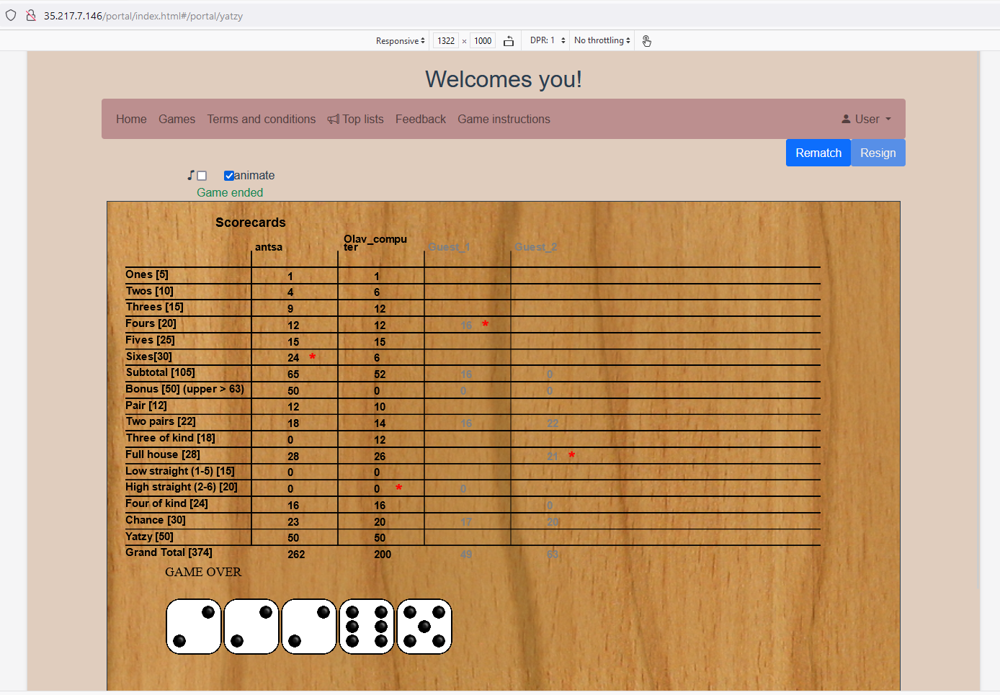
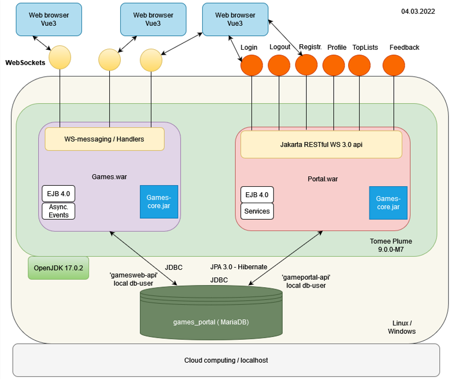
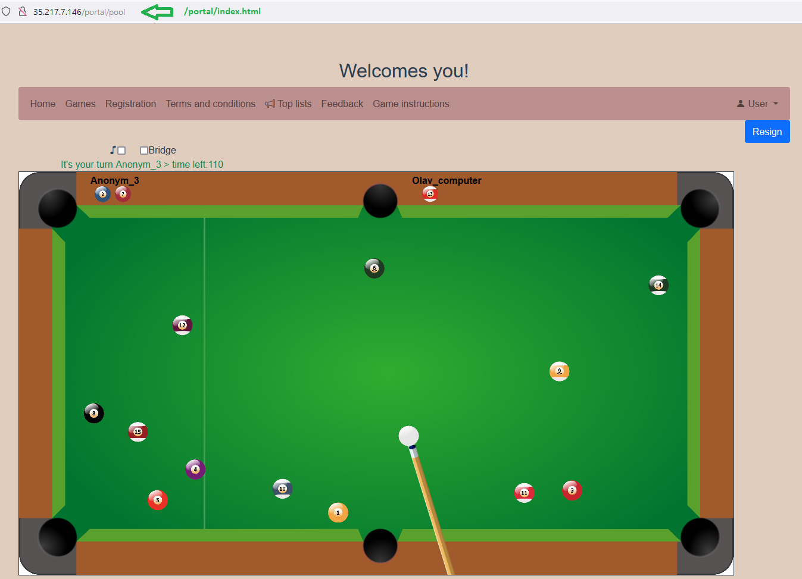
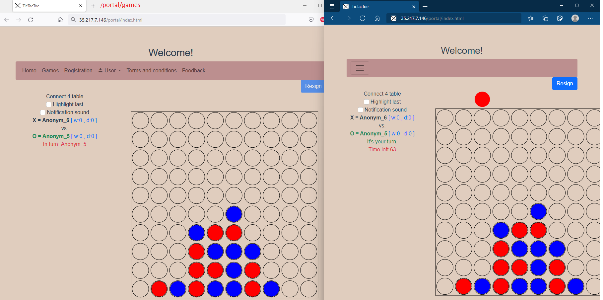

Site is currently running @ http://35.217.7.146/portal/index.html with three games, 8-ball (under test), tic-tac-toe and connect four.
 

### 15.07.2022 Yatzy into beta testing with new Tomee version (Tomee_plume 9.0.0-M8)
 
Yatzy now in beta testing. Welcomes!
Known issues: Jumping between tabs might cause UI not to change turn correctly -> No roll button visible when animation is selected.

### Overall architechture image:

 
### Technical dev setup 31.05.2022

   * Tomee_plume 9.0.0-M7
   * Node 16.15.0
   * OpenJDK 18.0.1 with the classpath exception, compiler compliance level Java 12
   * Eclipse Version: 2022-03 (4.23.0) (Backend-dev) integrated Maven commands with Mouse right click -> Run as..
   * Sometimes is required to run "Maven -> Update project.." two times as part of 'normal' acrobatics.
   * MariaDB 10.6.3 Community Edition ( 10.7.3 is ok, 10.8.3 not tested yet)
   * HeidiSQL 11.3, sql-script to create db is in workspace-setup folder
   * Visual Studio code (frontend dev) 
     
### 26.04.2022
New game, eight ball is now available for testing. Play against computer or human, or watch others play.

  
Some known bugs (or features) exist. UI and backend have own calculations of the table situation. If these calculations do not match then user(s) play against obsolete table. Server calculations are sent as snapshots.They are loaded in case user re-activates the gaming tab (comes back from another tab browser tab/window).
 
UI creates turns from the data it receives from the server and then consumes these turns when queue is not blocking.
 
Images are from https://opengameart.org/content/8-ball-pool-assets with minor changes.
 
Also big help from https://www.youtube.com/watch?v=aXwCrtAo4Wc (part1 and 2)
 

 
### 04.03.2022
New deployment: with read player profile page containing game history. Tag "prod-rel-1.0.3" .

### 19.2.2022
New deployment with player top-lists. Package "prod-rel-1.0.1" .

### 14.2.2022
Initial release
 

 

## Further development ideas

UI:
* Add sorting for tables and users, own tab per game for example.
* Make optional notification sound when user enters/creates new table.

Backend:
* New Game?

General:
* Site runs with "http" -> "https" 

Documentation

